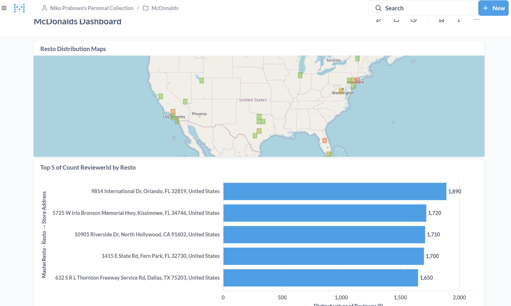

# ETL Project: McDonald's Store Reviews
This ETL project aims to process McDonald's Store Reviews data from Kaggle, transform it using Pentaho, and store it in a MySQL-based data warehouse. The data is then visualized using Metabase.

## Features
1. **ETL Pipeline** using Pentaho Data Integration.
2. **Containerization** with Docker and Docker Compose.
3. **Database Management** with MySQL and phpMyAdmin.
4. **Data Visualization** with Metabase.

## Directory Structure

```
etl_porto1/
├── docker/                 # Directory for Docker configuration
│   ├── docker-compose.yml   # Docker Compose file defining services
│   ├── init/                # Directory for database initialization scripts
│   │   └── init.sql         # SQL script to initialize the database
│   ├── metabase-data/       # **(Not uploaded)** Persistent data for Metabase, generated during `docker-compose up`
│   └── mysql_data/          # **(Not uploaded)** Persistent data for MySQL, generated during `docker-compose up`
├── pentaho/                # Directory for Pentaho tools
│   ├── data-integration/    # **(Not uploaded)** Extracted Pentaho Data Integration folder
│   └── pdi-ce-10.2.0.0-222.zip # **(Not uploaded)** Pentaho ZIP file, downloadable from [Pentaho Developer Edition](https://pentaho.com/pentaho-developer-edition/)
├── raw_data/               # Directory for raw data
│   ├── McDonald_s_Reviews.csv # **(Not uploaded)** Extracted CSV file used for transformations
│   └── mcdonalds-store-reviews.zip # **(Not uploaded)** ZIP file downloaded by the ETL process
├── scripts/                # Directory for scripts and transformation files
│   ├── create_tables.sql    # SQL script to create database tables
│   ├── get_raw_data.py      # Python script to download raw data
│   ├── Job1.kjb             # Pentaho Job file to execute transformations
│   ├── TransResto.ktr       # Pentaho Transformation file for MasterResto table
│   └── TransReview.ktr      # Pentaho Transformation file for Reviews table
├── images/                 # Directory for images
│   └── Dashboard.png        # Screenshot of the dashboard generated from the project
├── .gitignore              # File to exclude certain files/folders from Git
├── README.md               # Main project documentation
```

## Additional Information

### `pentaho` Directory
- The `pentaho` directory is not included in the repository. 
- You can create this directory and download the Pentaho Developer Edition from [Pentaho Developer Edition](https://pentaho.com/pentaho-developer-edition/).
- Extract the downloaded ZIP file into the `pentaho` directory.

### `metabase-data` and `mysql_data` Directories
- These directories are not included in the repository.
- They are automatically generated as persistent storage when running `docker-compose up`.

### `raw_data` Directory
- The `raw_data` directory is created manually and populated automatically during the ETL process.
  ```bash
  mkdir raw_data
  ```

### VM and Remote SSH
- I used Oracle VirtualBox for the Virtual Machine and Ubuntu for the OS, you can get my tutorial [How to Install Ubuntu Server on Oracle VirtualBox](https://www.datatensei.tech/2025/01/how-to-install-ubuntu-server-on-oracle.html).
- I used OpenSSH remote to create this porto, you can get my tutorial [How to Set Up Remote SSH on Oracle VirtualBox as Server](https://www.datatensei.tech/2025/01/how-to-set-up-remote-ssh-on-oracle.html)

## Requirements
1. **Oracle VirtualBox** (for the VM).
2. **Ubuntu** (as the OS inside the VM).
3. **Docker** and **Docker Compose**.
4. **Pentaho Data Integration** (PDI).
5. **MySQL** and **phpMyAdmin**.
6. **Python** (with the `kaggle` library).
7. **JDK (Java Development Kit)**: Required for Pentaho to function properly.
8. **MySQL Connector**: Required for Pentaho to connect to the MySQL database.

## Usage Instructions
1. **Clone the repository**:
    ```bash
    git clone https://github.com/username/etl_porto1.git
    cd etl_porto1
    ```

2. **Run Docker Compose**:
    ```bash
    cd docker
    docker-compose up -d
    ```

2. **Setup Pentaho**:
    Create a directory Pentaho and download the Pentaho Developer Edition, then extract it.
    ```bash
    mkdir etl_porto1/pentaho
    ```
    Then paste mysql-connector in ~/etl_porto1/pentaho/lib. Please remember to install JDK for Pentaho DI.

4. **Setup for Raw Data**: Ensure the Kaggle API is configured, then create the folder raw_data:
    ```bash
    mkdir etl_porto1/raw_data
    ```

5. **Run SQL to Create Tables**:
    Execute the `create_tables.sql` script to create the necessary tables in the MySQL database before running any transformations:
    ```bash
    docker exec -i [mysql_container_name] mysql -u [mysql_user] -p[mysql_password] [database_name] < scripts/create_tables.sql
    ```
    Replace `[mysql_container_name]`, `[mysql_user]`, `[mysql_password]`, and `[database_name]` with your actual MySQL container name, user, password, and database name. For example:
    ```bash
    docker exec -i mysql_etl_porto1 mysql -u niko -pniko etl_porto1 < scripts/create_tables.sql
    ```

6. **Data Transformation with Pentaho**:
    - Run the Pentaho Job file to execute transformations:
      ```bash
      sh [path_to_kitchen.sh] -file="[path_to_project_directory]/scripts/Job1.kjb"
      ```
      Replace `[path_to_kitchen.sh]` with the full path to the `kitchen.sh` script (e.g., `/path/to/data-integration/kitchen.sh`) and `[path_to_project_directory]` with your project directory.

7. **Visualize Data**:
    Access Metabase at [http://localhost:3001](http://localhost:3001).
    Connect it to the MySQL database for visualizations.

## License
This project is licensed under the [MIT License](LICENSE).

---

# Dataset and Transformations

This project processes a dataset containing McDonald's Store Reviews from Kaggle. Below is an explanation of the raw data structure and the transformations applied to create two clean tables: **MasterResto** and **Reviews**.

## Raw Data Overview
The raw data (`McDonald_s_Reviews.csv`) contains the following fields:
- `reviewer_id`: Unique identifier for the reviewer.
- `store_name`: Store name.
- `category`: Type of store (e.g., "Fast food restaurant").
- `store_address`: Store address.
- `latitude`, `longitude`: Geographical coordinates of the store.
- `rating_count`: Total number of ratings for the store.
- `review_time`: Time of the review.
- `review`: Text of the review.
- `rating`: Rating given by the reviewer.

Example raw data:  
| reviewer_id | store_name  | category                | store_address                            | latitude  | longitude   | rating_count | review_time | review                                                                 | rating  |
|-------------|-------------|-------------------------|------------------------------------------|-----------|-------------|--------------|-------------|------------------------------------------------------------------------|---------|
| 1           | McDonald's  | Fast food restaurant    | "13749 US-183 Hwy, Austin, TX 78750..." | 30.460717 | -97.792874  | 1,240        | 3 months ago | "Why does it look like someone spit on my food? ..."                  | 1 star  |
| 2           | McDonald's  | Fast food restaurant    | "13749 US-183 Hwy, Austin, TX 78750..." | 30.460717 | -97.792874  | 1,240        | 5 days ago   | "It'd McDonalds. It is what it is as far as the food and atmosphere..."| 4 stars |

---

## Table 1: **MasterResto**
**Description**: A summary table containing unique restaurant details.  
**Fields**:
- `resto_id` (INT): Primary key.
- `store_address` (VARCHAR(100)): Address of the store.
- `latitude` (DOUBLE): Latitude coordinate.
- `longitude` (DOUBLE): Longitude coordinate.
- `rating_count` (INT): Total number of ratings.

**Transformation Steps**:
1. Input the raw data from CSV.
2. Filter rows where `store_address` contains "2476 Kal" (invalid data).
3. Select `store_address`, `latitude`, `longitude`, and `rating_count`.
4. Group by `store_address`, `latitude`, and `longitude`.
5. Add a sequence to generate a primary key (`resto_id`).
6. Output the data to the `MasterResto` table.

**Example Output**:  
| Resto ID | Store Address                                      | Latitude       | Longitude       | Rating Count |
|----------|---------------------------------------------------|----------------|-----------------|--------------|
| 1        | "1044 US-11, Champlain, NY 12919, United States"  | 44.98140990    | -73.45981990    | 1,306        |
| 2        | "10451 Santa Monica Blvd, Los Angeles, CA..."     | 34.05659320    | -118.42599960   | 2,251        |
| 3        | "10901 Riverside Dr, North Hollywood, CA..."      | 34.15250740    | -118.36790360   | 1,795        |

---

## Table 2: **Reviews**
**Description**: A table containing individual reviews linked to restaurants in `MasterResto`.  
**Fields**:
- `reviewer_id` (BIGINT): Unique identifier for each reviewer.
- `resto_id` (INT): Foreign key linked to `MasterResto`.
- `review_time` (VARCHAR(13)): Time of the review.
- `review` (TEXT): Text of the review.
- `rating` (VARCHAR(7)): Rating given by the reviewer.

**Transformation Steps**:
1. Input the raw data from CSV.
2. Filter rows where `store_address` contains "2476 Kal" (invalid data).
3. Perform a stream lookup to map `store_address` to `resto_id` from `MasterResto`.
4. Select `reviewer_id`, `resto_id`, `review_time`, `review`, and `rating`.
5. Output the data to the `Reviews` table.

**Example Output**:  
| Reviewer ID | Resto ID | Review Time  | Review                                                              | Rating   |
|-------------|----------|--------------|----------------------------------------------------------------------|----------|
| 1           | 9        | 3 months ago | "Why does it look like someone spit on my food? ..."                 | 1 star   |
| 2           | 9        | 5 days ago   | "It'd McDonalds. It is what it is as far as the food and..."         | 4 stars  |
| 3           | 9        | 5 days ago   | "Made a mobile order got to the speaker and checked it in..."        | 1 star   |

## Visualization Results
Below are sample dashboards created using Metabase to analyze the data:



---

# ETL Project Report

## Summary
- **Project Name**: McDonald's Store Reviews ETL
- **Duration**: 2 Weeks
- **Technologies**: Docker, MySQL, Pentaho, Metabase, Python.

## ETL Workflow
1. **Extract**:
   - Download data from Kaggle using Python.
2. **Transform**:
   - Use Pentaho to clean and process the data.
3. **Load**:
   - Store the transformed data in MySQL.
4. **Visualize**:
   - Create dashboards in Metabase.

## Challenges
- Managing dependencies on Ubuntu VM.
- Building an efficient ETL pipeline with Pentaho.

## Outcomes
- Successfully deployed and automated the pipeline using Docker.
- Created a data visualization dashboard to analyze review data.

## Detailed Workflow
1. **Extract**:
   - Download McDonald's store review data from Kaggle using Python.

2. **Transform**:
   - Clean and process the data using Pentaho Transformations (.ktr files).
   - Run the Pentaho Job (.kjb file) using the following command:
     ```bash
     sh [path_to_kitchen.sh] -file="[path_to_project_directory]/scripts/Job1.kjb"
     ```
     Replace `[path_to_kitchen.sh]` with the full path to the `kitchen.sh` script and `[path_to_project_directory]` with your project directory.

3. **Load**:
   - Load the transformed data into MySQL as the data warehouse.

4. **Visualize**:
   - Visualize the data using Metabase.

---

Ensure all dependencies, including JDK and MySQL Connector, are installed before running the transformations. Remember to execute the `create_tables.sql` script to set up the required database tables.
